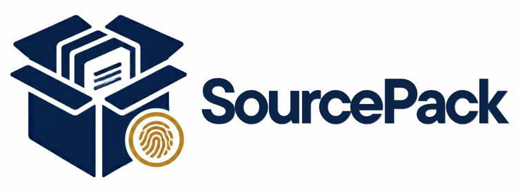

<p align="center">
  
</p>

# SourcePack

Bundle your research sources with hashes and provenance into one archive you can verify later, and keep track of which evidence is due for another look.

Collecting sources is easy; proving later which exact file a claim rested on is not. SourcePack copies files you already have into a ZIP, records each file's SHA-256, size and the metadata you give it (title, URL, retrieval date, licence, key passages), and can later detect anything that was changed, removed or slipped in. It never downloads anything. It uses only the Python standard library and makes no network requests.

## Install

Requires Python 3.10 or newer.

```bash
pip install git+https://github.com/seun-john/sourcepack.git
```

## Build an archive

```bash
sourcepack build sources.json --root ./research --archive evidence-2026-10.zip -o report.json
```

```json
{"sources": [
  {"path": "papers/smith2020.pdf", "title": "Smith 2020", "url": "https://doi.org/10.1/x",
   "retrieved_at": "2026-10-01", "licence": "CC BY 4.0", "archive_permission": true,
   "passages": [{"page": 4, "text": "Overall, rates fell by 12.5%."}]}
]}
```

- `archive_permission: true` is required for every file. It is your confirmation that you may copy it.
- Paths must be inside `--root`. The archive is created exclusively and **never overwrites** an existing file.
- The report gives a `manifest_sha256`. **Store it somewhere else** (an email to yourself, a ticket, a signed commit).

## Verify

```bash
sourcepack verify evidence-2026-10.zip --manifest-hash <manifest_sha256> --root ./research
```

| Finding | Meaning |
| --- | --- |
| `PASS` | A file's hash and size match the manifest, or the manifest matches the hash you stored. |
| `TAMPERED` | A file, or the manifest, differs from what was recorded. |
| `MISSING` / `UNLISTED_FILE` | A listed file is gone, or the archive holds a file the manifest does not list. |
| `ORIGINAL_CHANGED` / `ORIGINAL_MISSING` | With `--root`: the source on disk is no longer the file that was archived. |
| `UNANCHORED` | No `--manifest-hash` was given, so a rewritten manifest would go unnoticed. |

## Evidence freshness

```bash
sourcepack fresh freshness.json
```

```json
{"as_of": "2026-10-07", "sources": [
  {"id": "s1", "checked_at": "2026-01-01", "review_after_days": 90, "claim_ids": ["c3", "c7"],
   "previous_fingerprint": "abc", "current_fingerprint": "abd"}
]}
```

`REVIEW_DUE` when the source's age reaches your interval (with the `next_review` date), `WITHIN_REVIEW_WINDOW` otherwise, `SOURCE_CHANGED` when the two fingerprints you supplied differ, and `NEEDS_REVIEW` / `INVALID_DATE` for missing or impossible dates. `as_of` defaults to today. "Due" means "look again under your policy", not "out of date".

All commands take `-o report.json`, `--html report.html` and `--strict`. Exit codes: 0 completed, 1 `--strict` and something other than a pass was reported, 2 unusable input.

## Limits

- Copies local files only. No retrieval, no OCR, no PDF page extraction and no licence checking: the URL, date and licence are whatever you wrote.
- The manifest is not signed. Without an independently stored `manifest_sha256`, someone who can edit the archive can edit the manifest to match.
- Passages and metadata are stored as given and not checked against the files.
- Freshness uses dates and fingerprints you supply and does not fetch anything.

## Develop

```bash
pip install -e ".[dev]"
ruff check . && ruff format --check . && pytest -q
```

MIT licence.
